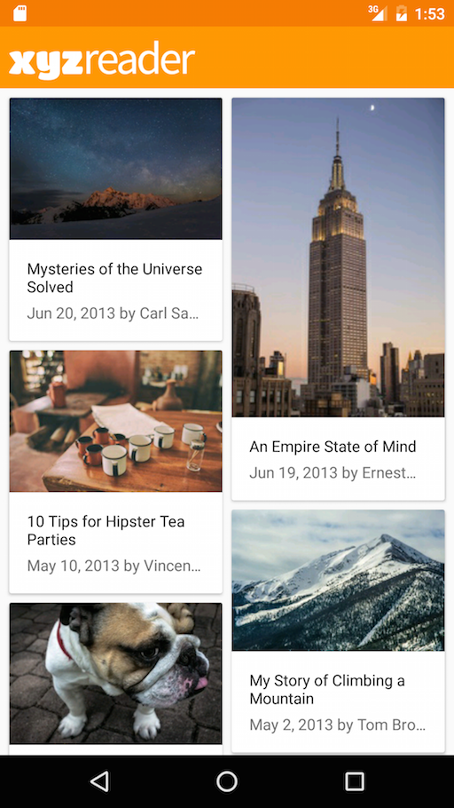
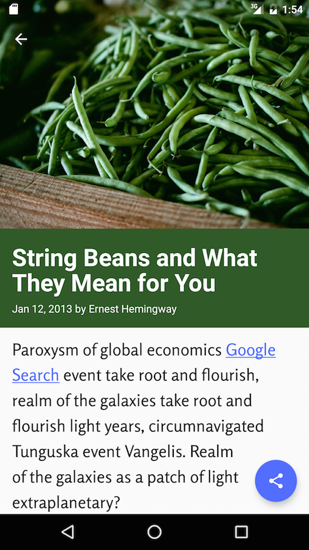
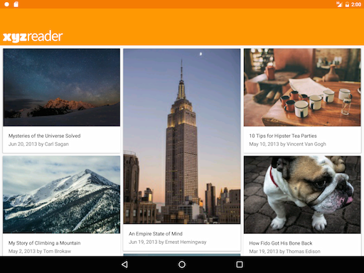

# XYZ Reader

## Project Overview
In this project, you will redesign an app to follow the Material Design guidelines and translate a set of static design mocks to a living and breathing app.

### Why this Project?
This project gives you an opportunity to improve an app’s design, a vital skill for building apps users will love. It also replicates a common developer task of updating and changing an app's design as new standards are released.

### What Will I Learn?
Through this project, you will:
- Understand the fundamentals of Android design.
- Apply Material Design guidelines to an mobile application.
- Separate an interface into surfaces.
- Effectively use transitions and motion.

### Required Tasks
- Download a zip file of the app.
- Read the UI Review in the next node.
- Spend time exploring the current state of the app, looking for ways it could be improved. The app will need multiple improvements. Be sure to look specifically at issues called out in the UI Review.
- Execute the improvements!
- Make a single GitHub repo with your code for the app and submit it through the Nanodegree portal. See the Submission and Evaluation node for detailed instructions.

### User Feedback for XYZ Reader:
- Lyla says:
“This app is starting to shape up but it feels a bit off in quite a few places. I can't put finger on it but it feels odd.”

- Jay says:
“Is the text supposed to be so wonky and unreadable? It is not accessible to those of us without perfect vision."

- Kagure says:
“The color scheme is really sad and I shouldn't feel sad.”

### Screenshots after redesign

